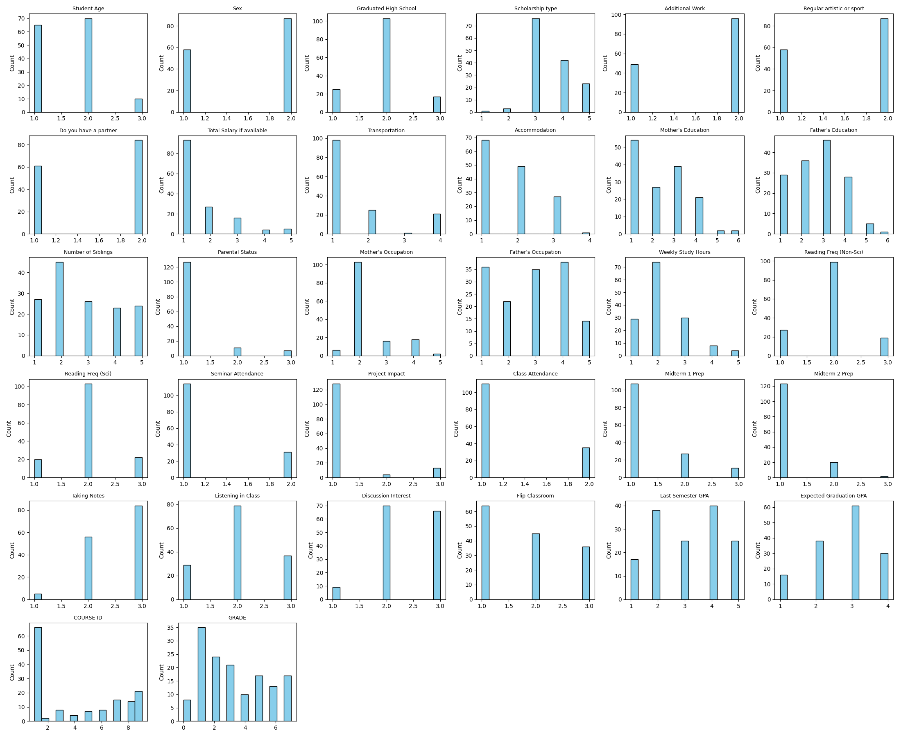
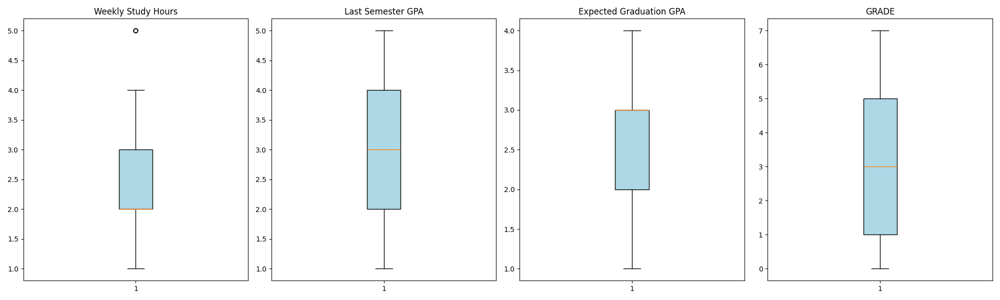
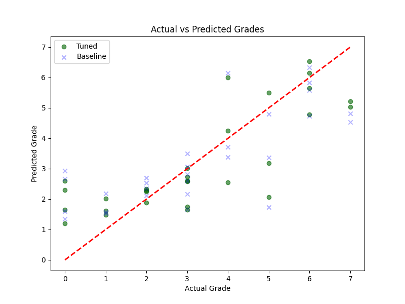
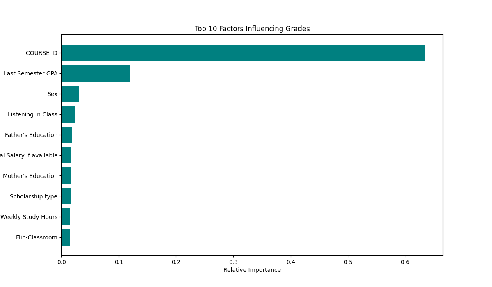
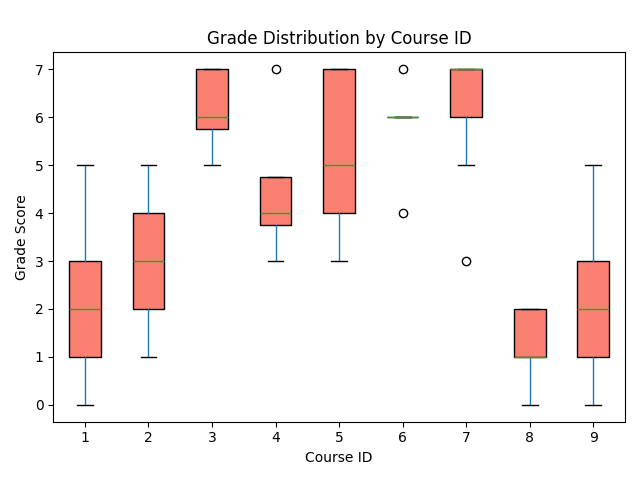
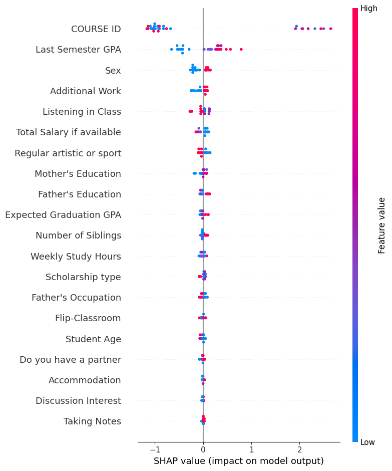
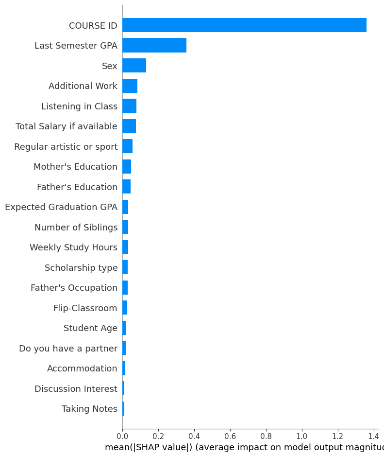

Group 7 Machine Learning Project

Explanation of all files

offline_model.py - The actual model, analyzes the dataset and generates all diagrams. Comments show step-by-step process our group went through.

run_with_ngrok.py - script that hosts the website on user's server.

app.py - Streamlit webapp

model.py - lesser copy of the model linked to the web app. Doesn't generate diagrams.

**Student Performance Analysis: Guide to Diagrams**

**Dataset Overview**

Before diving into the visualizations, here is a simple breakdown of the data we
analysed.

- **What is it?** A collection of performance records from a higher education
    evaluation system.
- **Size:** We have data for **145 students** (rows) covering **33 different attributes**
    (columns).
- **Key Data Points:**
    o **Student ID:** A unique label for each student (no duplicates).
    o **Questions 1–30:** These are survey questions about habits, family, and
       lifestyle. Students answered on a scale of **1 to 5**.
    o **Course ID:** Indicates which of the 9 courses the student took (numbered
       1–9).
    o **Final Grade:** This is the score we are trying to predict. It ranges from **1**
       **(Lowest)** to **7 (Highest)**.
- **Quality:** The dataset is very clean, meaning there were no missing values or
    blank spots we had to fix.
- **Why the Dataset Is Useful**
- The dataset is suitable for:
- • Predicting student grades
- • Identifying factors that influence academic outcomes
- • Building ML models such as Logistic Regression or Random Forest
- • Understanding student performance across courses

**1. Histograms (Distribution of Data)**

What is this?

Think of this as a "headcount" for every question in the survey.

- **The X-axis (bottom)** shows the possible answers (e.g., 1 to 5).
- **The Y-axis (side)** shows how many students picked that answer.

How we made it:

We took every column in the spreadsheet and asked Python to count the frequency of
each number.

**What it tells us:**

- Most of our data is "categorical," meaning students chose from specific options
    (like "Yes/No" or "1-5").
- You can see gaps between the bars, which confirms the data isn't continuous
    (like exact height or weight) but discrete (like multiple-choice answers).

**2. Boxplots (Outlier Detection)**

What is this?

A boxplot is a way to look at the "spread" of grades or study hours.

- **The Box:** Represents the "middle 50%" of students. Most people fall inside this
    box.
- **The Line in the Middle:** The median (the exact middle student).
- **The Whiskers (Lines sticking out):** The range of typical students.
- **The Circles (Dots):** These are "outliers"—students who are very different from
    the rest (e.g., someone studying 0 hours or getting a perfect Grade 7 when most
    get 3).

How we made it:

We selected key numeric columns (like Weekly Study Hours and GPA) and calculated
their statistical range.

**What it tells us:**

- Our data is fairly stable.
- We can clearly see the range of grades (0 to 7), which is our target to predict.

**3. Correlation Matrix (Heatmap)**

What is this?

This is a grid that checks if two questions "move together."

- **Red / Warm Colours:** Positive relationship. (If X goes up, Y goes up).
- **Blue / Cool Colours:** Negative relationship. (If X goes up, Y goes down).
- **The Diagonal Line:** It is always dark red because every question matches itself
    perfectly.

How we made it:

We used a mathematical formula called "Pearson Correlation" which gives a score
between -1 and 1 for every pair of questions.

**What it tells us:**

- It helps us spot redundancy. If two questions are dark red, they probably ask the
    same thing.
- It helps us spot hints. We look for rows that are coloured (not white) relative to
    the GRADE column.

**4. Actual vs. Predicted (Model Accuracy)**

What is this?

This acts as a "report card" for our Artificial Intelligence model.

- **X-axis:** The grade the student _actually_ got.
- **Y-axis:** The grade our model _guessed_ they would get.
- **The Red Line:** This is the "Line of Perfection." If a dot lands on this line, the model
    guessed perfectly.

How we made it:

We hid 20% of the data (the "Test Set") from the model. After training, we asked the
model to guess the grades for these hidden students and plotted the answers.

**What it tells us:**

- **Clustering:** The blue dots are grouped reasonably close to the red line. This
    means our model is generally accurate.
- **Error:** The distance of a dot from the red line represents the "error" (e.g.,
    predicting a 4 when the student got a 6).

- **5. Feature Importance (Bar Chart)**

What is this?

This is a ranking of "What matters most?" It tells us which survey questions helped the
AI predict the grade.

How we made it:

We asked our Random Forest model: "When you make decisions, which questions do
you look at the most?"

**What it tells us:**

- **The #1 Driver:** COURSE ID is the biggest bar by far. This means the specific
    course a student takes matters more than their individual habits.
- **The #2 Driver:** Expected Graduation GPA. Students who set high goals perform
    better.

**6. Course ID Impact (Grade by Course)**

What is this?

Since COURSE ID was the #1 predictor, we zoomed in to see why.

- Each box represents a different course (Course 1, Course 2, etc.).
- The position of the box shows the average grade in that course.

**What it tells us:**

- **Huge Variation:** Some courses (like Course 7) have very high grades (average
    ~6.0). Others (like Course 8) have very low grades (average ~1.4).
- **Conclusion:** The model relies on Course ID because some courses are simply
    "easier" or "harder" (or graded differently) than others.

**7. SHAP Summary Plot (The "Why")**

What is this?

This is an advanced chart that explains direction.

- **Red Dots:** High value (e.g., lots of study hours).
- **Blue Dots:** Low value (e.g., very few study hours).
- **Right Side:** Increases the predicted grade.
- **Left Side:** Decreases the predicted grade.

**How to read it:**

- Look at **Expected Graduation GPA**. You will see **Red Dots on the Right**.
- **Translation:** "High expectations (Red) lead to higher grades (Right)."
- Look at a negative factor. You might see **Red Dots on the Left**.
- **Translation:** "High values of this feature lower the grade."

**8. SHAP Bar Plot (Simple Ranking)**

What is this?

This is a simplified version of the previous chart. It ignores the "direction" and just
focuses on the magnitude (strength) of the impact.

What it tells us:

It confirms our Feature Importance findings but uses a more sophisticated method
(Game Theory) to ensure the ranking is fair. It re-confirms that COURSE ID and Expected
GPA are the kings of this dataset.

